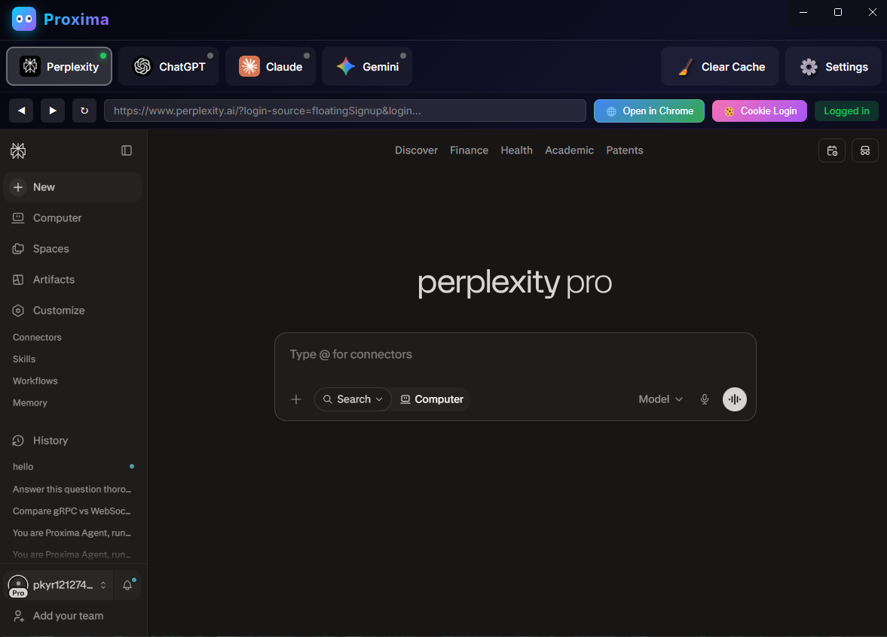
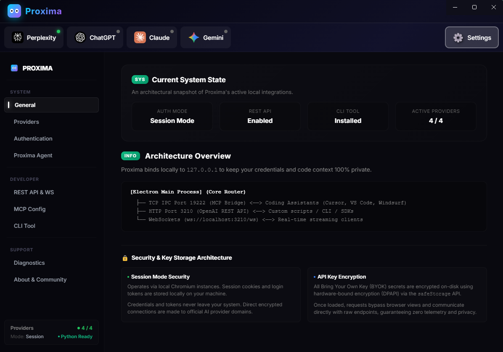
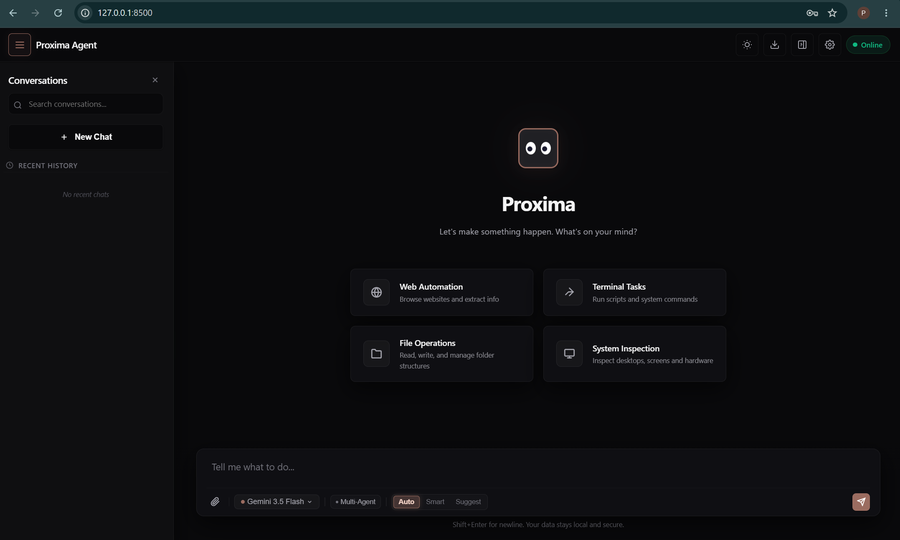
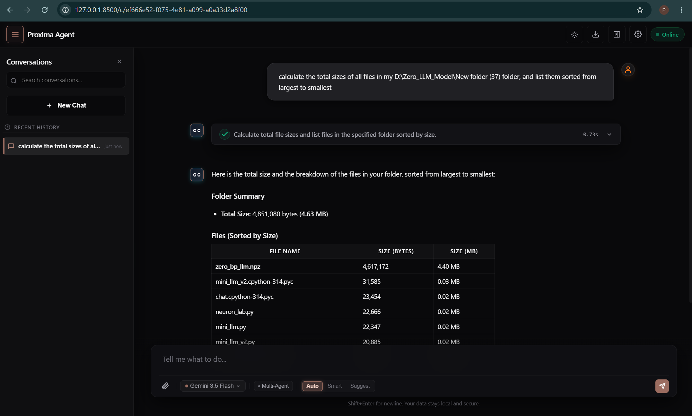
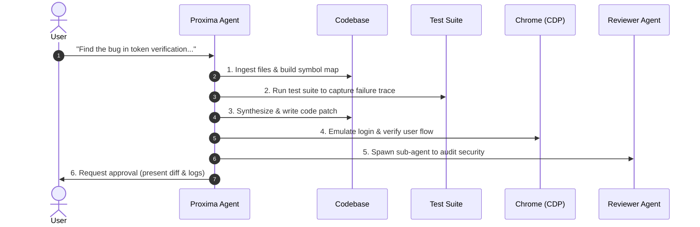
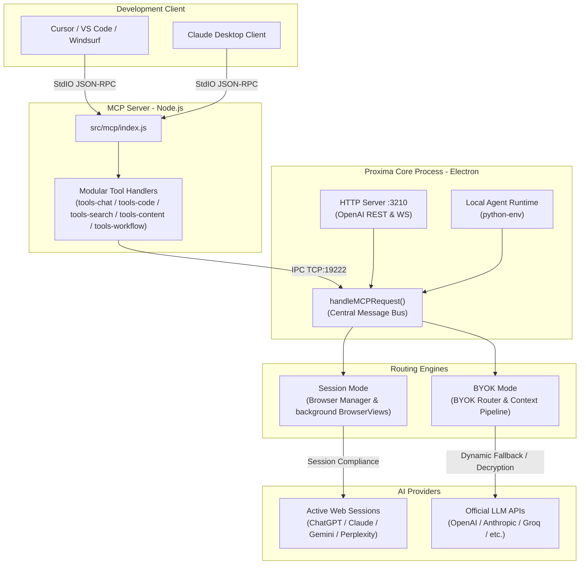

<div align="center">


# Proxima

### All your AI models, working under one roof.

**Run frontier LLMs directly inside Cursor, VS Code, Windsurf, or Claude Desktop using free browser login sessions or local offline providers. Ships with a self-healing Python agent, multi-agent delegation, and cross-session memory.**

[](https://github.com/Zen4-bit/Proxima/releases)
[](https://github.com/Zen4-bit/Proxima)
[](https://www.proximamcp.in)
[](https://github.com/sponsors/Zen4-bit)
[](LICENSE)

</div>

---

<details>
<summary><b>📖 Table of Contents</b></summary>

- [Why Proxima?](#why-proxima)
  - [The Solution: Proxima](#the-solution-proxima)
- [Interface Preview](#interface-preview)
- [Routing Modes](#routing-modes)
  - [1. Session Routing (Default)](#1-session-routing-default)
  - [2. BYOK (Bring Your Own Key) Routing](#2-byok-bring-your-own-key-routing)
- [Sponsor Wall](#sponsor-wall)
- [Meet Proxima Agent](#meet-proxima-agent)
  - [Core Agent Capabilities](#core-agent-capabilities)
  - [A Real-World Agent Scenario](#a-real-world-agent-scenario)
  - [Gated Execution Safety](#gated-execution-safety)
- [State, Memory & Prompt Management](#state-memory--prompt-management)
  - [Context Tracking & Prompt Routing](#context-tracking--prompt-routing)
  - [Local SQLite Memory Engines](#local-sqlite-memory-engines)
- [Quick Start](#quick-start)
  - [1. Prerequisites](#1-prerequisites)
  - [2. Install & Start](#2-install--start)
  - [3. Connect to Your Editor (MCP)](#3-connect-to-your-editor-mcp)
- [Architecture](#architecture)
  - [1. System Topology & Data Flow](#1-system-topology--data-flow)
  - [2. Core Subsystems](#2-core-subsystems)
- [All MCP Tools (40)](#all-mcp-tools-40)
  - [Core Orchestration Tools](#core-orchestration-tools)
  - [Tool Catalog](#tool-catalog)
- [REST API](#rest-api)
- [WebSocket](#websocket)
- [CLI](#cli)
- [SDKs](#sdks)
- [Security & Privacy](#security--privacy)
- [Frequently Asked Questions](#frequently-asked-questions)
- [Testing](#testing)
- [Contributing](#contributing)
- [License](#license)
</details>

---

## Why Proxima?

In late 2025, I hit a massive roadblock with AI coding tools. Outdated training data caused coding models to frequently hallucinate, guess wrong solutions, and ruin codebases. I tried setting up local agents using Model Context Protocol (MCP) APIs, but the results were disappointing. The API responses were subpar and inaccurate, all while running up a bill for every single prompt.

That’s when a wild idea struck: What if we could turn actual web-based models—like ChatGPT, Gemini, Claude, and Perplexity—into local MCP servers? By routing queries directly through free, logged-in browser accounts, I could give my local agents access to frontier reasoning models. No expensive API keys required.

Proxima was born as a personal utility. I used it heavily for months to streamline my own work with no plans to open-source it. However, seeing other developers struggle with the same API costs and model hallucinations, I decided to share it. Proxima was created to provide a local, privacy-focused routing engine that connects development tools to active sessions without requiring paid subscriptions or API plans.

<details>
<summary><b>TL;DR: Common Pain Points Solve</b></summary>

*   **API Subscription Fatigue:** Stacking multiple AI subscriptions (ChatGPT Plus, Claude Pro, Perplexity Pro) adds up fast.
*   **Costly Development Keys:** Querying raw API endpoints directly from code editor extensions drains credits quickly on large codebases.
*   **Local-Model Privacy:** When running fully local models via Ollama or LM Studio, your code never leaves your machine — no cloud provider, no data exposure.
*   **Fragmented Tooling:** Constantly switching between browser windows, terminals, and editor panels disrupts your cognitive coding flow.
</details>

### The Solution: Proxima
Proxima serves as a local development gateway that centralizes and runs all your AI models together on `127.0.0.1`. By handling protocol translation and session routing in the background, it enables your coding agents and development clients to interact with multiple advanced providers or offline engines as a single, standard local endpoint.

---

## Interface Preview

<p align="center">
  <b>Proxima Status Dashboard</b>
  &nbsp;&nbsp;&nbsp;&nbsp;&nbsp;&nbsp;&nbsp;&nbsp;&nbsp;&nbsp;&nbsp;&nbsp;&nbsp;&nbsp;&nbsp;&nbsp;&nbsp;&nbsp;&nbsp;&nbsp;&nbsp;&nbsp;&nbsp;&nbsp;&nbsp;&nbsp;&nbsp;&nbsp;&nbsp;&nbsp;&nbsp;&nbsp;&nbsp;&nbsp;&nbsp;&nbsp;&nbsp;&nbsp;&nbsp;&nbsp;&nbsp;&nbsp;&nbsp;&nbsp;&nbsp;&nbsp;&nbsp;&nbsp;&nbsp;&nbsp;
  <b>Configuration & Settings</b>
  <br/>
  
  
  <br/>
  
  
  <br/>
  <b>Agent Website</b>
  &nbsp;&nbsp;&nbsp;&nbsp;&nbsp;&nbsp;&nbsp;&nbsp;&nbsp;&nbsp;&nbsp;&nbsp;&nbsp;&nbsp;&nbsp;&nbsp;&nbsp;&nbsp;&nbsp;&nbsp;&nbsp;&nbsp;&nbsp;&nbsp;&nbsp;&nbsp;&nbsp;&nbsp;&nbsp;&nbsp;&nbsp;&nbsp;&nbsp;&nbsp;&nbsp;&nbsp;&nbsp;&nbsp;&nbsp;&nbsp;&nbsp;&nbsp;&nbsp;&nbsp;&nbsp;&nbsp;&nbsp;&nbsp;&nbsp;&nbsp;&nbsp;&nbsp;&nbsp;&nbsp;&nbsp;&nbsp;&nbsp;&nbsp;&nbsp;&nbsp;&nbsp;&nbsp;&nbsp;&nbsp;
  <b>Agent Execution</b>
</p>

---

## Routing Modes

Proxima supports two primary modes to power your editor and agent integrations:

### 1. Session Routing (Default)
*   **Free Account Emulation:** Routes prompts through your logged-in browser accounts (ChatGPT, Claude, Gemini, Perplexity) inside sandboxed background browser views.
*   **No API Keys Required:** Reuses standard local cookies and browser sessions. No passwords or credentials are saved.
*   **Renderer-Level Interception:** Captures tokens directly from internal WebSocket and API streams, bypassing brittle HTML selectors for faster and more stable routing.

<blockquote style="border-left: 4px solid #d4af37; color: #d4af37; padding: 5px 15px; margin: 15px 0;">
  <strong>Note:</strong> <small><i>Session Mode automates your existing logged-in browser sessions (like any browser automation tool). This may technically fall outside some providers' standard ToS for programmatic access. It's your account, your session, your choice — but for production/commercial use, we recommend BYOK Mode with official API keys.</i></small>
</blockquote>

### 2. BYOK (Bring Your Own Key) Routing
*   **Broad Model Support:** Support for OpenAI, Anthropic, Google, DeepSeek, Groq, xAI, OpenRouter, Together, Fireworks, Mistral, and NVIDIA.
*   **Local Offline Hardware:** Intercepts configurations to run local models via **Ollama** or **LM Studio**.
*   **Secure Storage:** Keys are saved locally using your operating system's native keychain vault (via Electron's SafeStorage).
*   **Local Brain Integration:** Automatically applies context compaction, factual recall, and prompt-injection screening.

---

## Sponsor Wall

<div align="center">

*Proxima keeps evolving thanks to these amazing people*

<br/>

<a href="https://github.com/TheNetworker">
  
</a>

### [@TheNetworker](https://github.com/TheNetworker)
⭐ **Star Sponsor** &nbsp;·&nbsp; 🥇 <b>First Sponsor</b>

<br/>

*Great things are built together — [Be a part of our journey →](https://github.com/sponsors/Zen4-bit)*

</div>

---

## Meet Proxima Agent

The repository contains `proxima-agent/`, a local Python assistant. It executes codebase edits, runs test suites, and drives browser tasks by routing LLM calls through Proxima. This allows the agent to run completely free using your website providers or with custom API keys via BYOK mode.

### Core Agent Capabilities

*   **Self-Healing Debugging Loop:** Executes code, captures terminal and test-suite errors, and iteratively refactors the codebase until all tests pass.
*   **Autonomous Browser Control:** Drives Chrome instances via Chrome DevTools Protocol (CDP) to interact with frontends, verify UI layouts, and test user flows.
*   **Dynamic Skill Generation:** Writes custom Python helper scripts on the fly, tests them, and packages them into reusable runtime skills (`skills.db`) to expand its capabilities.
*   **Symbol-Mapped Codebase Analysis:** Maps local files, builds class/function symbol hierarchies, and isolates relevant code blocks to handle large context limits efficiently.

### A Real-World Agent Scenario

Imagine you instruct the agent: *"Find the bug in my token verification module, patch it, and verify that the authentication tests pass."*

Here is the exact trace of how Proxima Agent executes this task:



### Gated Execution Safety
The agent is bound by customizable safety permissions:
*   **Full Auto:** Executes all file writes and terminal commands instantly.
*   **Smart:** Auto-approves reading/searching but prompts you before running commands or overwriting code.
*   **Suggest:** Shows proposed code diffs and command lines, waiting for your manual approval.

---

## State, Memory & Prompt Management

To keep workflows fast and context accurate, Proxima features separate prompt and memory systems depending on the active routing engine.

### Context Tracking & Prompt Routing

*   **Session Mode:** In this mode, the target provider website (e.g., ChatGPT, Claude) maintains the active conversation state. Sending a massive system prompt containing 40+ tool definitions on every message would bloat the browser's context window, increasing latency and cost. Instead, Proxima runs a fast local classifier every turn. It dynamically analyzes your task and injects only the necessary tool references and relevant self-generated procedural hints.
*   **BYOK & Local Mode:** Proxima's prompt compiler manages the message payload lifecycle for custom API keys and offline endpoints. It formats the conversation history, applies system instructions dynamically, and executes a context compaction loop to summarize older chat turns, preventing token limit errors during large developer prompts.

### Local SQLite Memory Engines

Proxima maintains four separate, local, SQLite-backed databases (`~/.proxima-agent/*.db`) to enable cross-session statefulness:

*   **Conversation Vault (`vault.db`):** Tracks session lineage (supporting parent-child structures for multi-agent forks) and stores message histories securely.
*   **Insight Store (`insights.db`):** Extracts and stores cross-session user preferences, workspace patterns, and environmental facts to prevent repetitive setups.
*   **Experience Learning (`memory.db`):** Automatically caches compilation errors, syntax exceptions, and the edits that resolved them. The agent queries this history during self-healing loops to apply proven fixes instantly.
*   **Procedural Skills (`skills.db`):** Caches and evaluates custom script actions generated during tasks. The agent evaluates new skills through a Bayesian priority model, promoting them to "proven" or demoting/deprecating them based on Exponential Moving Average (EMA) success rates.

---

## Quick Start

Follow these steps to configure and connect Proxima to your local environment.

### 1. Prerequisites

| Platform | Requirements |
| :--- | :--- |
| **Node.js** | Version 18+ (Required to run the main server process) |
| **Python** | Version 3.10+ (Only required for the Proxima Agent) |
| **OS** | Windows · macOS · Linux support |

### 2. Install & Start

```bash
# Clone the repository
git clone https://github.com/Zen4-bit/Proxima.git
cd Proxima

# Install dependencies & start
npm install
npm start
```

> 💡 **Windows Users:** You can also download and run the latest `.exe` installer directly from the [Releases](https://github.com/Zen4-bit/Proxima/releases) page.

Once the desktop app opens:
1. **Session mode:** Log into ChatGPT, Claude, Gemini, or Perplexity in their respective tabs.
2. **BYOK mode:** Click Settings and paste your custom API keys or local host addresses.

### 3. Connect to Your Editor (MCP)

Add this server configuration block to your editor's MCP configuration settings (for example, in Cursor under *Settings -> Features -> MCP*):

```json
{
  "mcpServers": {
    "proxima": {
      "command": "node",
      "args": [
        "C:/absolute/path/to/Proxima/src/mcp/index.js"
      ]
    }
  }
}
```

> 💡 **Tip:** You can copy the exact configuration block with your machine's absolute paths directly from the **Settings ➔ MCP Configuration** tab inside the Proxima desktop app window.

---

## Architecture

The system consists of three primary layers: the **Proxima Runtime Host**, the **Model Context Protocol (MCP) Server**, and the **Local Agent Runtime**.

### 1. System Topology & Data Flow

Below is the complete architectural map showing how protocols, IPC bridges, and providers communicate:



### 2. Core Subsystems

#### Browser Session Compliance Layer
For **Session Mode**, Proxima loads each provider inside isolated `BrowserView` containers. The compliance layer includes:
*   **User-Agent Management:** Maintains standard browser user-agent strings for compatibility.
*   **Page Context Configuration:** Sets up standard preload scripts for correct rendering and provider compatibility.
*   **Direct Response Streaming:** Engine scripts (`electron/providers/engines/*`) capture streaming tokens directly from provider HTTP responses for real-time output.

#### Worker Control Protocol (WCP)
The Agent's workflow engine uses an internal command protocol (WCP) for multi-step task delegation, research routing, and temporary state management across sub-agents. See [docs/architecture.md](docs/architecture.md) for protocol details.

#### BYOK Local Brain & Context Pipeline
When **BYOK Mode** is active, Proxima utilizes a local intelligence buffer:
*   **Factual Recall & Experience Log:** Stores previous code errors, terminal exceptions, and successful fixes in an encrypted SQLite database to avoid repeating programming mistakes.
*   **Context Compaction Pipeline:** Uses token-estimation and cheap pruning heuristics (`byok/context/`) to summarize long conversation loops when approaching provider limits (preventing out-of-context crashes).
*   **Ollama/LM Studio Bridge:** Intercepts unknown custom provider configurations and loops them through standard OpenAI-compatible endpoints to support offline, local hardware execution.

Read [docs/architecture.md](docs/architecture.md) for full structural diagrams and details.

---

## All MCP Tools (40)

Registered by the modular MCP server (`src/mcp/`).

### Core Orchestration Tools
The following signature capabilities represent Proxima's custom orchestration logic:

| Tool | Command | Description |
| :--- | :--- | :--- |
| **Multi-Agent Collaboration** | `crew` | Spawn a collaborative swarm of models to review, critique, and optimize code before returning it. |
| **Consensus Routing** | `smart_query` | Query multiple model providers simultaneously, cross-verify their answers, or make them debate. |
| **Codebase Intelligence** | `analyze_file` | Ingest local files, build structural symbol maps, and scan/strip credentials or secrets. |
| **Multi-Source Research** | `deep_search` | Perform targeted searches across Web, Reddit, GitHub, News, Academic, and Fact-check engines. |
| **Cross-AI Fact-Checking** | `verify` | Compare output from different providers, highlight inconsistencies, and score confidence. |
| **Algorithmic Compilation** | `solve` | Loop with compiler output and test runners to self-correct code based on diagnostic output until compilation passes. |
| **Vulnerability Scanner** | `security_audit` | Scan code snippets for SQL injections, XSS, insecure storage, and deprecated dependencies. |
| **Complex Workflow Loops** | `run_workflow` | Chaperone multi-step tasks requiring chaining and conditional validation of different tools. |

---

### Tool Catalog

<details>
<summary><b>Chat & Routing</b></summary>

| Tool | Description |
| :-- | :-- |
| `ask_chatgpt` | Send a message to ChatGPT |
| `ask_claude` | Send a message to Claude |
| `ask_gemini` | Send a message to Gemini |
| `ask_perplexity` | Send a message to Perplexity |
| `ask_model` | Send to any session or BYOK provider |
| `ask_all_ais` | Query all enabled providers simultaneously |
| `smart_query` | Auto-route with modes: `auto` · `verify` · `consensus` · `collaborate` |
| `new_conversation` | Reset a provider's conversation |

</details>

<details>
<summary><b>Code</b></summary>

| Tool | Description |
| :-- | :-- |
| `generate_code` | Generate code from a description |
| `review_code` | Review a snippet for bugs, security, and best practices |
| `explain_code` | Line-by-line code explanation |
| `optimize_code` | Performance optimization suggestions |
| `verify_code` | Best-practices check for a stated purpose |
| `solve` | Solve a programming problem |
| `fix_error` | Fix an error with code patches |
| `explain_error` | Plain-English error explanation with fixes |
| `convert_code` | Translate code between languages/frameworks |
| `build_architecture` | Design system architecture |
| `write_tests` | Generate comprehensive test files |
| `security_audit` | Deep security vulnerability audit |

</details>

<details>
<summary><b>Search & Web</b></summary>

| Tool | Description |
| :-- | :-- |
| `deep_search` | Typed search: `web` · `reddit` · `github` · `news` · `math` · `academic` · `factcheck` · `stats` |
| `ddg_search` | Free DuckDuckGo link search (no provider needed) |
| `web_scrape` | URL → Markdown (SSRF-guarded) |
| `get_ui_reference` | Fetch UI design references |

</details>

<details>
<summary><b>Content</b></summary>

| Tool | Description |
| :-- | :-- |
| `content` | `summarize` · `write` · `brainstorm` · `howto` · `analyze` · `extract` · `improve` |
| `compare` | Side-by-side comparison |
| `debate` | Multi-perspective debate |
| `verify` | Cross-AI fact-checking with confidence ratings |

</details>

<details>
<summary><b>Files & Codebase</b></summary>

| Tool | Description |
| :-- | :-- |
| `analyze_file` | Codebase-pack + smart-slice + symbol extraction + secret scan |
| `review_code_file` | Review a single file on disk |

</details>

<details>
<summary><b>Workflow & Agentic</b></summary>

| Tool | Description |
| :-- | :-- |
| `run_workflow` | Execute a multi-step workflow |
| `run_loop` | Run an iterative refinement loop |
| `crew` | Multi-AI collaborative task execution |
| `proxima_cost_report` | Token usage and cost report |
| `proxima_agentic_status` | Agentic system status |

</details>

<details>
<summary><b>Utility</b></summary>

| Tool | Description |
| :-- | :-- |
| `clear_cache` | Clear internal caches |
| `show_window` | Show the Proxima dashboard window |
| `hide_window` | Hide the Proxima dashboard window |
| `toggle_window` | Toggle Proxima window visibility |
| `set_headless_mode` | Run Proxima in headless mode |

</details>

---

## REST API

OpenAI-compatible API at `http://localhost:3210` (enable in Settings).

### Endpoints

```http
POST /v1/chat/completions      # OpenAI-compatible chat (stream, tools, functions)
GET  /v1/models                # List available models (session or BYOK)
GET  /v1/functions             # Function catalog
GET  /v1/stats                 # Per-provider response stats
POST /v1/conversations/new     # Reset a provider's conversation

# BYOK brain endpoints
GET  /v1/byok/keys             # BYOK key management
GET  /v1/byok/models           # BYOK model management
GET  /v1/brain/recall          # Cross-session recall
GET  /v1/brain/experience      # Learned experiences
GET  /v1/brain/skills          # Stored skills
GET  /v1/brain/stats           # Brain statistics

GET  /api/status               # Server status
GET  /                         # Interactive documentation
```

### Example Request

```bash
curl http://localhost:3210/v1/chat/completions \
  -H "Content-Type: application/json" \
  -d '{"model": "claude", "message": "What is AI?"}'
```

The `model` field accepts: `auto`, a provider name (`claude`, `chatgpt`, `gemini`, `perplexity`), `all`, or an array like `["claude", "chatgpt"]`.

---

## WebSocket

Real-time streaming at `ws://localhost:3210/ws` (requires REST API enabled).

```javascript
const ws = new WebSocket("ws://localhost:3210/ws");

ws.send(JSON.stringify({
  action: "ask",
  model: "claude",
  message: "Explain closures in JavaScript",
  id: "req-1"
}));

ws.onmessage = (e) => {
  const data = JSON.parse(e.data);
  console.log(data); // status updates + streamed response chunks
};
```

---

## CLI

Install via **Settings ➔ Install CLI to PATH**, or `npm link`.

```bash
# Ask any provider
proxima ask "How does async/await work?"
proxima ask claude "Explain React hooks"

# Code tools
proxima code review "function f(){...}"      # actions: generate/review/debug/explain
proxima fix "SyntaxError: Unexpected token"

# Pipe build errors directly
npm run build 2>&1 | proxima fix
proxima audit 'SELECT * FROM users WHERE id=' + input

# Content tools
proxima debate "tabs vs spaces"
proxima brainstorm "dev productivity features"
proxima compare "Bun vs Node.js"
proxima translate "Hello world" --to Hindi

# Search & analyze
proxima search "latest Node.js release"
proxima analyze "https://example.com" -q "what is this?"

# Session management
proxima new <provider>          # reset a conversation
proxima models | status | stats
```

**Flags:** `-m/--model`, `--json`, `--file`, `--to`, `--from`, `-q/--question`

---

## SDKs

<table>
<tr>
<td>

**Python**

```python
# Requires: pip install requests
# Copy sdk/proxima.py into your project
from proxima import Proxima

client = Proxima()
response = client.chat("Hello", model="claude")
print(response.text)
```

</td>
<td>

**JavaScript**

```javascript
// Node 18+
const { Proxima } = require('./sdk/proxima');

const res = await new Proxima().chat("Hello", {
  model: "claude"
});
console.log(res.text);
```

</td>
</tr>
</table>

---

## Security & Privacy

| Principle | Implementation |
| :--- | :--- |
| **Local-first** | MCP/IPC (`:19222`) and REST/WS (`:3210`) bind to `127.0.0.1`. Nothing exposed to the internet. |
| **Credential isolation** | Session mode reuses existing browser logins — no passwords saved. BYOK keys are encrypted in your OS keychain (SafeStorage). |
| **No telemetry** | Only your explicit queries go to the providers you choose. |
| **Gated execution** | The agent executes code by design, protected by permission modes and a safety gate. |
| **SSRF protection** | `web_scrape` and the agent's web fetcher are SSRF-guarded. |

> **Found a vulnerability?** Follow [SECURITY.md](SECURITY.md) — use GitHub Security Advisories, don't open a public issue.

---

## Frequently Asked Questions

### Is Proxima really free?
Yes. If you use **Session Mode**, it communicates with the official web platforms through your active browser login sessions. There are no fees, and you don't need any paid API keys. You only pay if you explicitly choose **BYOK Mode** to connect your own API tokens.

### Is my data private?
Yes. Proxima itself stores nothing on external servers—no logs, chats, keys, or sessions leave your machine, and your configuration remains encrypted locally (using SafeStorage). However, remember that **Session Mode** still sends your prompts to the third-party AI provider you're logged into (that's how any AI chat works). For fully offline privacy where your code never leaves your local hardware, use local models via **BYOK Mode**.

### How does Session Mode work without passwords?
Proxima loads secure, isolated browser tabs (called BrowserViews) inside the background. When you log into ChatGPT or Claude inside these views, the browser maintains your active session logins locally on your device, just like Chrome or Firefox does. Proxima simply uses these local sessions to send standard prompts.

### Can I run local offline models?
Yes. BYOK mode supports any OpenAI-compatible custom endpoints. You can run **Ollama** or **LM Studio** offline on your own machine and route all requests through Proxima.

### Does the Python agent delete or modify my code automatically?
No. By default, the agent runs in **Suggest** or **Smart** mode. It will show you exactly what changes it wants to make and wait for you to click "Approve" before modifying any files or running commands.

---

## Testing

```bash
# JavaScript test suite
npm test

# Python agent test suite
cd proxima-agent && python -m unittest discover -s tests -p "test_*.py"
```

See [TESTING.md](TESTING.md) for the full testing strategy and coverage details.

---

## Contributing

Contributions are welcome! See [CONTRIBUTING.md](CONTRIBUTING.md) for:
*   Fork ➔ Branch ➔ PR workflow
*   Coding style guidelines
*   Mock-at-boundary test strategy

Please read our [Code of Conduct](CODE_OF_CONDUCT.md) before contributing.

---

## License

Proxima is licensed under the **Proxima Personal Use License** (Personal, Non-Commercial use only).  
See [LICENSE](LICENSE) for the full license text and terms. For commercial licensing inquiries, please contact the repository author.

---

<div align="center">

<br/>

**Proxima v5.0.0** — Making every AI work together

Built by [**Zen4-bit**](https://github.com/Zen4-bit)

<br/>

[Website](https://www.proximamcp.in) · [Releases](https://github.com/Zen4-bit/Proxima/releases) · [Architecture](docs/architecture.md) · [Changelog](CHANGELOG.md)

</div>
