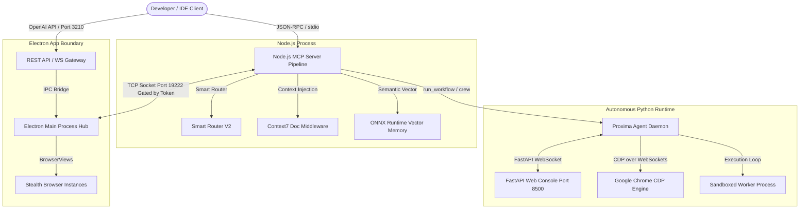

# Proxima System Architecture

This document describes the high-level system architecture of **Proxima v5.0.0**. The platform has transitioned from a basic browser-session proxy into a modular, multi-tier agentic ecosystem composed of three primary layers: the **Electron Hub Layer**, the **Node.js MCP Middleware Pipeline**, and the **Autonomous Python Agent Runtime**.

---

## 1. Electron Hub Layer (Main Process)

The Electron application acts as the coordinator and system host. It manages state, logins, local settings, and provides access to standard browser session runtimes.

* **Stealth Session Management (`browser-manager.cjs`):** Spins up decoupled BrowserViews matching the active providers (ChatGPT, Claude, Gemini, Perplexity). Configures custom User-Agents, stealth parameters (disabling `AutomationControlled` and Blink automation flags), and handles direct Javascript script injections to extract session tokens.
* **REST/WS Server (`rest-api.cjs`):** Listens on port `3210` by default. Exposes OpenAI-compatible endpoints (`/v1/chat/completions`, `/v1/models`) so developers can point any standard library (like OpenAI's SDK) to Proxima. Supports static authorization keys (`api-key.json`).
* **Decoupled IPC Channels (`electron/ipc/`):** Communication between the Electron main process, preload scripts, and the renderer is handled via structured modules:
  * `core.cjs` — Coordinates main window visibility and state.
  * `settings.cjs` — Manages settings reading, writes, and cookie cleaning.
  * `cli.cjs` — Bridges command-line parameters to the UI thread.

---

## 2. In-Process MCP Middleware Pipeline (Node.js)

The MCP Server implements the official `@modelcontextprotocol/sdk` and acts as the intelligence pipeline. Instead of sending raw prompts to AI endpoints, all queries pass through local in-process middleware layers:

* **Context7 Documentation Middleware (`context7-middleware.js`):** Intercepts queries to detect library mentions (React, Vue, FastAPI, Docker, etc.) using regular expression patterns. Retrieves up-to-date documentation via `https://mcp.context7.com` and prepends it to the prompt context. Uses a local map-cache (TTL 10m, Max 200 items).
* **EMA-based Smart Router (`smart-router.js`):** Classifies incoming tasks (e.g. `code-gen`, `research`, `security`) and matches them to provider strengths. Tracks response times using an Exponential Moving Average (EMA) latency formula (`avg * 0.7 + call_time * 0.3`) and isolates failing providers for 60 seconds if they hit 3 consecutive timeouts or errors.
* **Memory & Fact Harvesting (`memory-intelligence.js`):** Harvesters parse conversation inputs to automatically extract technology stack preferences and user configurations. These are saved to `enhanced-memory.json` with a 7-day half-life decay function, archiving any facts that decay below a quality threshold.

---

## 3. Autonomous Python Agent Platform (`proxima-agent/`)

Introduces an independent Python executor environment that handles physical actions and self-healing compilation:

* **CDP Browser Automation (`browser_cdp.py`):** Operates Google Chrome directly using Chrome DevTools Protocol over WebSockets (port 9222) rather than depending on heavy libraries like Selenium.
* **Self-Healing Run Loop (`self_heal.py`):** Runs executing scripts inside sandboxed subprocess workers. If a compilation or test check fails, it captures the error log, matches it against an experience database (`learned_fixes.json`), applies recovery code corrections, and learns from successful runs.
* **Suggest/Smart Permission Gates (`permissions.py`):** Evaluates risk scores of command blocks (e.g. `rm -rf`, `os.system` carry risk weight 3). Halts for manual authorization in **Smart Mode** if risk score `>= 3`, or prompts a list of choices using `[SUGGEST]` blocks in **Suggest Mode**.
* **FastAPI Console Web Server (`web/server.py`):** Serves local REST APIs and WebSockets on port `8500` protected by a loopback origin-guard middleware to block cross-origin requests.

---

## 4. Inter-Process Communication & Safety Gating

* **Token-Gated TCP Bridge (`main-v2.cjs` <-> `ipc-bridge.js`):**
  Communication between the Node.js MCP server process and the Electron Hub process occurs over a local TCP socket (`127.0.0.1`, starting at port `19222`). To prevent unauthorized local processes from hijacking the Electron browser sessions, the main process writes a cryptographically random token to `ipc-token.json` on launch. All requests sent over the TCP channel must include this token in the JSON payload to be authorized.
* **Context Compaction:**
  When token budgets are exhausted during conversations, the context pipeline compresses older turns:
  * **Pruner (`pruner.cjs`):** Truncates verbose tool execution outputs (e.g. file contents, search arrays) and assistant arguments.
  * **Condenser (`condenser.cjs`):** Replaces middle conversation turns with a single concise summary generated by the LLM, keeping system instructions and recent conversation lines intact.
